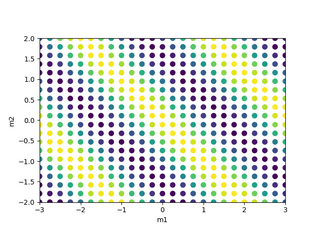
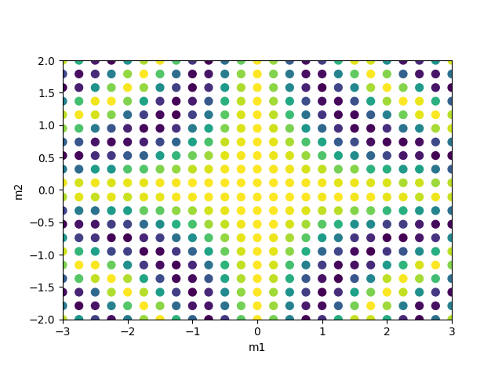
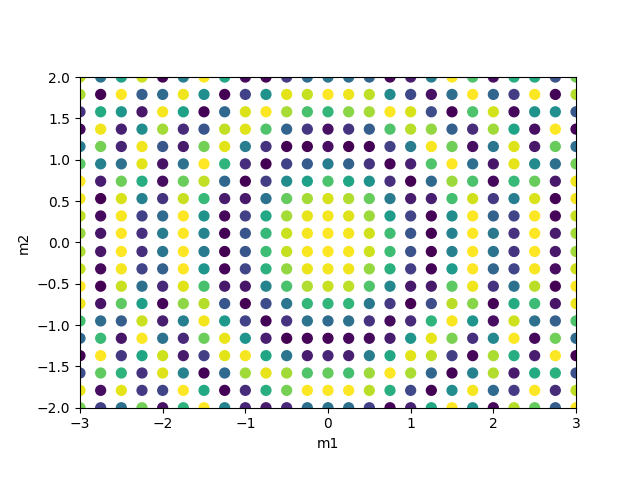
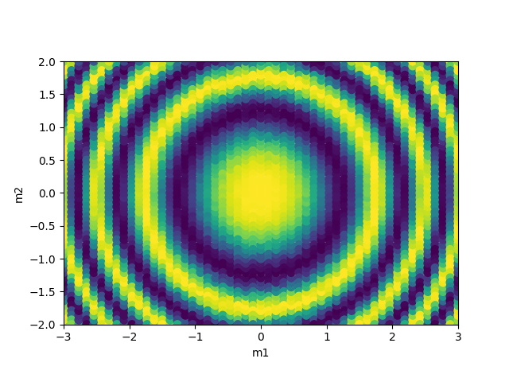
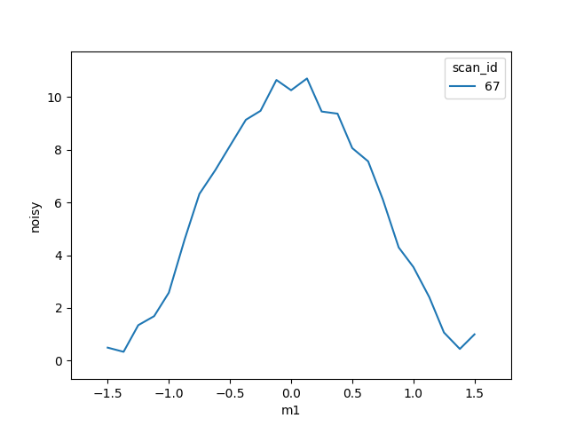

Various findings and code samples and thoughts while exploring
the [NSLS-II](http://nsls-ii.github.io) software called 
[BlueSky](http://nsls-ii.github.io/bluesky/).

## session using XXX IOC and this PV setup (pseudo detector)

	prjemian@poof ~/.../support/xxx-5-8-3 $ caput xxx:userCalc1.CALC rndm
	Old : xxx:userCalc1.CALC             0
	New : xxx:userCalc1.CALC             rndm
	prjemian@poof ~/.../support/xxx-5-8-3 $ caput xxx:userCalc1.SCAN .2 second
	Old : xxx:userCalc1.SCAN             Passive
	New : xxx:userCalc1.SCAN             .2 second
	prjemian@poof ~/.../iocBoot/iocLinux $ caput xxx:EnableUserCalcs 1
	Old : xxx:EnableUserCalcs            
	New : xxx:EnableUserCalcs            

## ipython session

	ipython --profile=bluesky
	wh_pos()
	m1.move(2)
	mov(m1, 0)
	noisy.describe
	noisy.describe_configuration()
	RE(scan([noisy], m1, 1, 5, 20), LiveTable([noisy, m1]))
	RE(scan([noisy], m1, 1, 5, 20), LivePlot('noisy', 'm1'))
	!mov
	mov(m1, 0)
	history

## mesh scans

A mesh scan is collected one point (pixel) at a time
covering a 2-D mesh by positioning each of two positioners.
There are a couple strategies for collection.  

BlueSky provides several [prebuilt plans](http://nsls-ii.github.io/bluesky/plans.html#built-in-plans) for mesh scans.
The plan used here is the [outer_product_scan](http://nsls-ii.github.io/bluesky/bluesky.plans.outer_product_scan.html#bluesky.plans.outer_product_scan) .
Here, the second 
(fast) axis is stepped across its range, then the first (slow)
axis is moved to its next step.  One strategy has the fast axis
always return to its start position before stepping.  A *snake*
strategy steps the fast axis from start to end on the first step 
of the slow axis, then end to start on the next slow step.  This 
is faster than the first strategy as it does need to return the 
fast axis to the start position.  If the fast axis is subject to
significant backlash correction at each step, the *snake* strategy
is not preferred.  The strategy below uses the *snake* strategy.

For visualization of the mesh scan while it is being collected,
BlueSky provides at least two choices:
[LiveRaster](http://nsls-ii.github.io/bluesky/callbacks.html#liveraster-gridded-heat-map)
or
[LiveMesh](http://nsls-ii.github.io/bluesky/callbacks.html#livemesh-scattered-heat-map).
The *LiveMesh* was chosen for the examples below since it scales the
independent axes by their values.  (The *LiveRaster* plots the image *v.* the pixel number.)

Note that the *LiveMesh* (by default) plots each pixel as a fat circle which color
represents the pixel value scaled between `low` and `high` as provided by `clim=(low,high)`.
The circles plotted in scan 4 below overlap, leading to a tiled effect on the image.
In the mesh, *m2* is the *fast* axis, *m1* is the *slow* axis.  Collection started in the 
lower left corner of the image and proceeded upwards to the top, then to the right by one column
and proceeded back down to the bottom, in a snake-like fashion.

* plan: [outer_product_scan](http://nsls-ii.github.io/bluesky/bluesky.plans.outer_product_scan.html#bluesky.plans.outer_product_scan)
* plot: [LiveMesh](http://nsls-ii.github.io/bluesky/callbacks.html#livemesh-scattered-heat-map)

### ipython commands

    import epics
    # setup "our detector" that is configured in ophyd as "noisy"
    epics.caput('xxx:userCalc1.INAN', 'xxx:m1.RBV')
    epics.caput('xxx:userCalc1.INBN', 'xxx:m2.RBV')
    epics.caput('xxx:userCalc1.C', '0.05')
    epics.caput('xxx:userCalc1.D', '10')
    # simple noisy signal, proportional to motor m1
    epics.caput('xxx:userCalc1.CALC', 'A+C*(rndm-0.5)')
    epics.caput('xxx:userCalc1.SCAN', '.2 second')
    epics.caput('xxx:EnableUserCalcs', '1')

#### mesh scan 1

Calculation: cos^2(m_1+m_2+\rho) where \rho is a small random number.

    epics.caput('xxx:userCalc1.CALC', 'D*cos(A+B+C*rndm)^2')
    RE(
        outer_product_scan([noisy], m1, -3, 3, 25, m2, -2, 2, 20, True), 
        LiveMesh('m1', 'm2', 'noisy', xlim=(-3,3), ylim=(-2,2), clim=(0, 10)),
        calc=epics.caget("xxx:userCalc1.CALC")
    )

#### mesh scan 2

Calculation: cos^2(m_1*m_2+\rho)

    epics.caput('xxx:userCalc1.CALC', 'D*cos(A*B+C*rndm)^2')
    RE(
        outer_product_scan([noisy], m1, -3, 3, 25, m2, -2, 2, 20, True), 
        LiveMesh('m1', 'm2', 'noisy', xlim=(-3,3), ylim=(-2,2), clim=(0, 10)),
        calc=epics.caget("xxx:userCalc1.CALC")
    )

#### mesh scan 3

Calculation: cos^2(m_1^2+m_2^2+\rho)

    epics.caput('xxx:userCalc1.CALC', 'D*cos(A^2+B^2+C*rndm)^2')
    RE(
        outer_product_scan([noisy], m1, -3, 3, 25, m2, -2, 2, 20, True), 
        LiveMesh('m1', 'm2', 'noisy', xlim=(-3,3), ylim=(-2,2), clim=(0, 10)),
        calc=epics.caget("xxx:userCalc1.CALC")
    )

#### mesh scan 4

Here, more pixels are collected over the same ranges.

Calculation: cos^2(m_1^2+m_2^2+\rho)

    RE(
        outer_product_scan([noisy], m1, -3, 3, 53, m2, -2, 2, 57, True), 
        (
             LiveMesh('m1', 'm2', 'noisy', xlim=(-3,3), ylim=(-2,2), clim=(0, 10)),
             LiveTable([m1, m2, noisy])
        ),
        calc=epics.caget("xxx:userCalc1.CALC")
    )

### save last scan's data to HDF5 file

    from suitcase.hdf5 import export
    export(db[-1], 'meshscan4.h5', mds, use_uid=False)

The NSLS-II [documentation](http://nsls-ii.github.io/bluesky/callbacks.html#export-all-data-and-metadata-in-an-hdf5-file)
describes a way to automatically save the data after every *stop* document 
is emitted (when the scan is done).  The actual code base has developed since
that documentation so there are a few typos to correct (the call is 
`suitcase.hdf5/export(headers, filename, mds, **kws)` and this use is 
shown above.

Here is the command line code:

    header = db[-1]
    doc = header.start
    filename = '{}_{}.h5'.format(doc.beamline_id, doc.scan_id)
    export(header, filename, mds, use_uid=False)

Here is my revision to the automated version:

    import suitcase.hdf5
    import os
    
    def write_hdf5_callback(name, doc):
        if name != 'stop':
            return
        header = db[doc.run_start]
        start = header.start
        filename = '{}_{}.h5'.format(start.beamline_id, start.scan_id)
        suitcase.hdf5.export(header, filename, mds, use_uid=False)
        print('wrote: ' + os.path.abspath(filename))
    
    RE.subscribe('stop', write_hdf5_callback)

#### NeXus support

A branch of the [NSLS-II/suitcase](https://github.com/NSLS-II/suitcase) 
repository is being developed in a GitHub fork+branch to add a
[NeXus](https://github.com/BCDA-APS/suitcase/blob/NeXus/suitcase/nexus.py) 
`suitcase.nexus.export()` function with identical call signature to the 
`suitcase.hdf5.export()` function.

Here is the NeXus callback handler:

	'''
	write every scan to a NeXus file

	file: 95_write_NeXus_when_stop.py

	When a `stop` document is received, write the most recent scan 
	to a NeXus HDF5 file.
	'''

	import suitcase.nexus
	import os

	def write_nexus_callback(name, stop_doc):
		# name == 'stop'
		# stop_doc is db[-1]['stop']
		if name != 'stop':
		    return
		header = db[stop_doc['run_start']]
		print(sorted(list(header.keys())))
		start = header.start
		filename = '{}_{}.h5'.format(start.beamline_id, start.scan_id)
		suitcase.nexus.export(header, filename, mds, use_uid=False)
		print('wrote: ' + os.path.abspath(filename))

	RE.subscribe('stop', write_nexus_callback)
	# RE(scan([noisy], m1, -1, 1, 3), LiveTable([noisy, m1]))
	# write_nexus_callback('stop', db[-1]['stop'])

and here is a use of it:

	In [2]: RE(scan([noisy], m1, -1, 1, 3), LiveTable([noisy, m1]))
	Transient Scan ID: 59
	Persistent Unique Scan ID: '4c884315-4f8c-4260-865e-88e7de2a2477'
	+-----------+------------+------------+------------+------------------+
	|   seq_num |       time |      noisy |         m1 | m1_user_setpoint |
	+-----------+------------+------------+------------+------------------+
	|         1 | 15:51:20.8 |    0.57867 |   -1.00000 |         -1.00000 |
	|         2 | 15:51:22.0 |    0.38813 |    0.00000 |          0.00000 |
	|         3 | 15:51:23.3 |    0.60305 |    1.00000 |          1.00000 |
	+-----------+------------+------------+------------+------------------+
	generator scan ['4c8843'] (scan num: 59)
	['descriptors', 'start', 'stop']
	wrote: /home/prjemian/Documents/eclipse/suitcase/developer_59.h5
	Out[2]: ['4c884315-4f8c-4260-865e-88e7de2a2477']

	In [3]: 

Here is a scan with a plot:

	In [13]: epics.caput('xxx:userCalc1.INAN', 'xxx:m1.RBV')
	    ...: epics.caput('xxx:userCalc1.INBN', 'xxx:m2.RBV')
	    ...: epics.caput('xxx:userCalc1.C', '1')
	    ...: epics.caput('xxx:userCalc1.D', '10')
	    ...: epics.caput('xxx:userCalc1.CALC', 'D*cos(A)^2+C*RNDM')
	    ...: epics.caput('xxx:userCalc1.SCAN', '.2 second')
	    ...: epics.caput('xxx:EnableUserCalcs', '1')
	    ...: RE(scan([noisy], m1, -1.5, 1.5, 25), LivePlot('noisy', 'm1'))
	    ...: 
	Transient Scan ID: 67
	Persistent Unique Scan ID: 'ff20af55-5bb8-46d0-a7db-331e4209d5c7'
	['descriptors', 'start', 'stop']
	wrote: /home/prjemian/Documents/eclipse/suitcase/developer_67.h5
	Out[13]: ['ff20af55-5bb8-46d0-a7db-331e4209d5c7']

	In [14]: 

Note: the [NeXus data file: developer_67.h5](developer_67.h5) is written 
now at the end of the scan into the current working directory.  
Here's the plot:

## *hkl* reciprocal space

* NSLS-II package: [hklpy](https://github.com/NSLS-II/hklpy) : very sparse documentation now
* Soleil's support library for [hkl](https://github.com/picca/hkl) :  some documentation in English, some in French:
